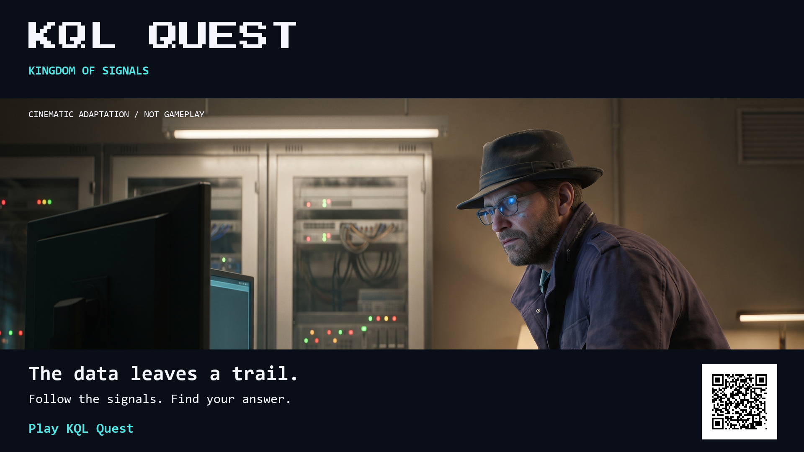

# KQL Quest: Kingdom of Signals

[](marketing/video/kql-quest-main-voiceover.mp4?raw=true)

KQL Quest is a browser-based pixel-art adventure for learning Kusto Query
Language. Explore the Kingdom of Signals, collect evidence, and write queries
at in-world terminals. The results help you test an explanation and decide
what to investigate next.

Queries run against synthetic data in a local KQL interpreter. No Azure account
or live customer data is needed to play locally. Use a desktop browser and
keyboard.

[Watch the narrated trailer](marketing/video/kql-quest-main-voiceover.mp4?raw=true)
| [Browse the marketing kit](marketing/README.md)
| [Play KQL Quest](https://didiergbenou-ms.github.io/playwithkql/)

The play destination is reserved for the team's launch and is not published
yet. Its current 404 is expected. The trailer combines labelled cinematic
adaptation, terminal stills and gameplay captured from an earlier prototype.
Its narration is synthetic; the current playable scope is listed below.

## Marketing material

The [marketing kit](marketing/README.md) includes two A2 posters, a double-sided
A5 leaflet, social graphics, editable SVGs, QR codes and seven videos with
captions. There are 15- and 30-second cuts for LinkedIn, Instagram and Teams,
plus three full-length narration takes.

Use the [channel copy](marketing/copy/channel-kit.md) for posts and image alt
text. The artwork displays **Play KQL Quest** instead of the full address.
Print PDFs and editable SVGs have labelled links; PNGs and videos carry QR
codes. These files are a team handoff, not a deployment of the game site.

## Hackathon project

Created for the [Microsoft Global Hackathon 2026](https://innovation-studio.microsoft.com/events/hackathon2026/page/about)
under the **Build Skills for the Hardest Problems CSS Faces** Executive Challenge.

The initial mission pack focuses on support and observability scenarios used
by Customer Service and Support (CSS). The learning format is intended for
people who want to practise KQL beyond those roles too.

## The problem

Knowing an operator's syntax does not tell you when to use it. KQL Quest puts
the query inside an investigation: write it, inspect what comes back, and
decide whether the evidence supports your theory.

## Learning experience

The query tools include:

- `take` to inspect a few rows
- `distinct` to identify machines
- `where` with `ago()` to filter recent signals
- `summarize` with `max()` to find last-seen times
- Applying those operators to a second table to find the cause

Terminals explain a concept with a worked example before asking you to use it.
You can inspect the schema, read authored hints and try your own query. Grading
checks the returned results and any required operators, rather than matching
your text to one expected spelling.

## Hackathon roadmap

These are project goals. The current playable scope is described under
**Project status** below.

- Expand to five distinct KQL missions
- Add a final investigation battle beyond the current verdict console
- Extend the existing browser-based KQL editor and synthetic-data interpreter
- Add an AI coach alongside the current authored hints
- Add a mastery dashboard and before-and-after skill measurement
- Grow the reusable case format into future learning packs

## Design direction

The playable game uses pixel art, square terminal frames and a CRT-inspired
interface. The wider direction is a retro fantasy adventure with original
characters. Cinematic marketing art is labelled as adaptation, not gameplay.

## Success measures

The team plans to evaluate:

- Mission completion rate
- Query accuracy
- Time to correct an unsuccessful query
- Reduction in hints across missions
- Improvement between the initial and final mastery checks

## Project status

The current `develop` build has a local KQL interpreter, four characters and
three selectable case files. This is the implemented portion of a larger
chapter-based game, not a limit on its final scope.

| Case | Map | Content status |
|---|---|---|
| 001 | Heartbeat Hills | Fleet scope, aggregation and structured configuration evidence |
| 002 | Signal Harbor | Log discovery, timelines and administrator audit context |
| 003 | Relay Ruins | Performance reports, calculations and incident closeout |

The three maps investigate one synthetic March 11 network-path incident through
different evidence. Each has its own terminal, gate, evidence and note IDs.
Choose a case, difficulty and recruit; replay and switching start fresh runs.
Profiles remain shared across cases, and in-progress runs are not saved on reload.

Each case has Beginner, Intermediate and Expert question sets. Choose a case,
then a difficulty and recruit. Nine sets of five terminals give **45 executable
questions** on the three maps; difficulty changes the questions, not movement.
The supplied curriculum's 12 Beginner questions have three additions. Higher
tiers are adapted to supported local analysis. Adapted content remains labelled
for editorial review, with sources and license notices.

Completion and best scores are recorded separately for each case and difficulty.
Older aggregate profile history is retained but is not assigned to a tier.

**New to the project?** Follow the [local development guide](docs/LOCAL_DEVELOPMENT.md)
for the full steps to install the tools, clone `develop`, and run the game on
Windows, macOS, or Linux.

```bash
npm install
npm run dev
```

See [implementation notes](docs/IMPLEMENTATION.md) for the architecture,
design decisions and features that are not built yet.

## Contributing

AI coding assistants can use the repository's
[KQL Quest development skill](.github/skills/kql-quest-dev/SKILL.md) to locate
level maps, wire terminals and gates, and follow the development workflows.

Copilot also has a short [repository entry point](.github/copilot-instructions.md).
For another assistant, explicitly attach the skill instead of assuming it is
automatically discovered.

**Start with one case, map, or subsystem per PR.** The
[contributor workflow](docs/LOCAL_DEVELOPMENT.md#contribute-one-scoped-change)
explains file boundaries, the independent case starter, content checks and the
dev-only content workbench at **`?author=1`**. The workbench opens lessons and
verdicts directly without playing through the map or saving game progress.

Use the repository's issue forms for **case content**, **maps**, **UI/accessibility**
or **audio** to record an owner, scope and observable acceptance criteria.
Ideas and non-code contributions are welcome too; define the intended player
experience before asking an AI to implement it.

## Responsible development

The prototype uses synthetic data only. Current hints are authored, not
AI-generated. Any future AI coach should use the active mission's evidence,
avoid giving away solutions immediately, and distinguish suggestions from
verified query results.

## License

Licensing information will be added before external distribution.
