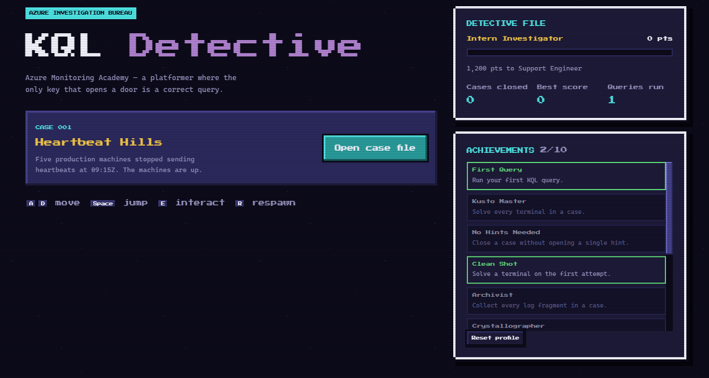

# KQL Quest: Kingdom of Signals



KQL Quest is a pixel-art platform adventure that helps anyone learn Kusto Query Language (KQL) through exploration, puzzles, and real query-writing challenges.

Players explore the Kingdom of Signals, collect evidence, and use KQL in terminal-based encounters to defeat anomalies. Instead of memorizing syntax in isolation, learners apply each operator to a practical investigation.

## Hackathon project

This project was created for the [Microsoft Global Hackathon 2026](https://innovation-studio.microsoft.com/events/hackathon2026/page/about) under the **Build Skills for the Hardest Problems CSS Faces** Executive Challenge.

The first mission pack focuses on support and observability scenarios relevant to Customer Service and Support (CSS). The platform itself is designed for anyone who wants to learn KQL.

## The problem

KQL learning is often passive and disconnected from real investigations. Beginners may recognize operators without knowing how to combine them to answer an unfamiliar question.

KQL Quest turns that learning process into an interactive adventure where progress depends on understanding the data.

## Learning experience

The initial path introduces:

- `where` to filter signals
- `project` to select and shape evidence
- `summarize` to reveal patterns
- `sort` to rank results
- `top` to identify the most important findings

Each mission combines:

1. A story-driven investigation
2. A synthetic dataset
3. A query objective
4. Immediate, explainable feedback
5. Optional AI-guided hints
6. A mastery check before progression

## Hackathon MVP

- Five playable KQL missions
- A final investigation battle
- A browser-based KQL editor
- Safe execution against synthetic data
- An AI coach that explains errors and provides progressive hints
- A mastery dashboard
- Before-and-after skill measurement
- A reusable mission format for future learning packs

## Design direction

The experience uses a polished retro fantasy style with pixel art, an emerald CRT interface, terminal glow, bloom, and subtle screen distortion. The visual identity is inspired by classic platform adventures without using third-party characters, names, artwork, or other protected assets.

## Success measures

- Mission completion rate
- Query accuracy
- Time to correct an unsuccessful query
- Reduction in hints across missions
- Improvement between the initial and final mastery checks

## Project status

A playable prototype now lives in this repository: a real KQL interpreter,
four characters, and three selectable case files.

| Case | Map | Content status |
|---|---|---|
| 001 | Heartbeat Hills | Original investigation, five terminals and a final verdict |
| 002 | Signal Harbor | New four-room map; reuses Case 001 lessons and data for now |
| 003 | Relay Ruins | New four-room map; reuses Case 001 lessons and data for now |

Cases 002 and 003 are playable scaffolds for later content authoring, not new
support diagnoses. Each has its own terminal, gate, evidence and note IDs.
Choose a case before choosing a recruit; replay and switching start fresh runs.
Profiles remain shared across cases, and in-progress runs are not saved on reload.

**New to the project?** Follow the [local development guide](docs/LOCAL_DEVELOPMENT.md)
for the full steps to install the tools, clone `develop`, and run the game on
Windows, macOS, or Linux.

```bash
npm install
npm run dev
```

See **[docs/IMPLEMENTATION.md](docs/IMPLEMENTATION.md)** for how it is built and
why, and for what is deliberately not built yet.

## Contributing

AI coding assistants can use the repository's
[KQL Quest development skill](.github/skills/kql-quest-dev/SKILL.md) to locate
level maps, wire terminals and gates, and follow the development workflows.

Ideas, mission scenarios, KQL examples, game design, accessibility feedback, and implementation contributions are welcome. Open an issue to propose a change or describe how you would like to help.

## Responsible development

The prototype uses synthetic data only. AI-generated guidance should be grounded in the active mission, should not expose solutions immediately, and should clearly distinguish hints from verified query results.

## License

Licensing information will be added before external distribution.
