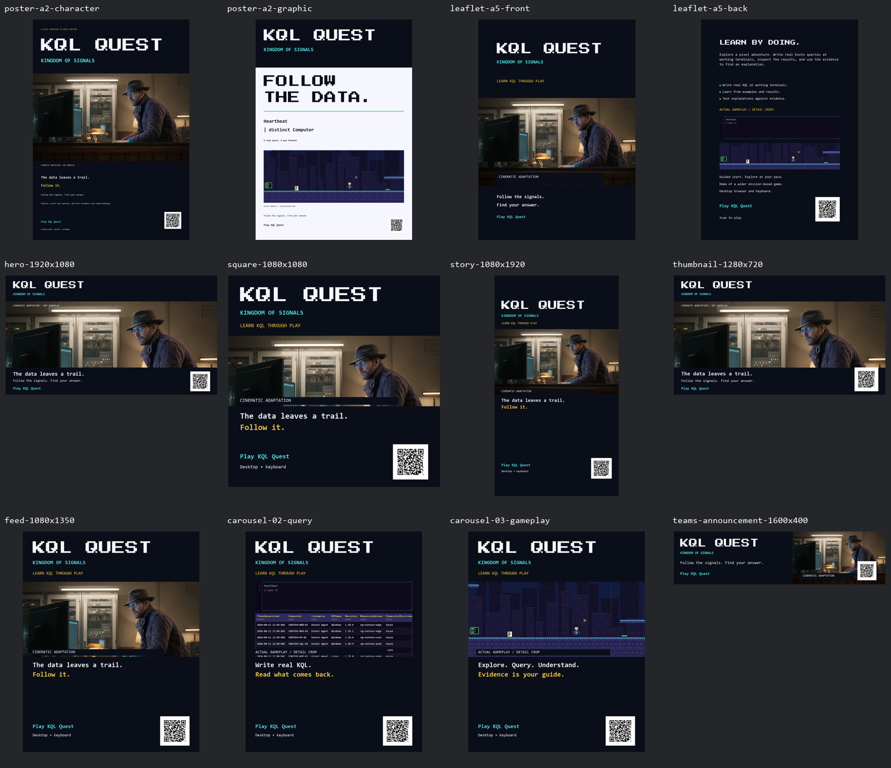

# KQL Quest marketing kit

Start with the [main narrated trailer](video/kql-quest-main-voiceover.mp4?raw=true)
or the [posting copy](copy/channel-kit.md). The package uses the title
**KQL Quest: Kingdom of Signals** and the visible link label **Play KQL Quest**.
It does not advertise a fixed number of chapters.

## Videos

| Download | Length and format | Use |
|---|---|---|
| [Main narration](video/kql-quest-main-voiceover.mp4?raw=true) | 58s, 1280x720 | Main trailer |
| [Deadpan narration](video/kql-quest-deadpan-voiceover.mp4?raw=true) | 58s, 1280x720 | Drier alternate |
| [Learner narration](video/kql-quest-learner-voiceover.mp4?raw=true) | 58s, 1280x720 | Warmer alternate |
| [30s landscape](video/kql-quest-30s.mp4?raw=true) | 1280x720 | LinkedIn, Teams |
| [15s landscape](video/kql-quest-15s.mp4?raw=true) | 1280x720 | Short teaser |
| [30s vertical](video/kql-quest-30s-vertical.mp4?raw=true) | 1080x1920 | Instagram Reel |
| [15s vertical](video/kql-quest-15s-vertical.mp4?raw=true) | 1080x1920 | Instagram Story |

All videos are H.264 at 30fps with stereo AAC audio. Matching SRT files are in
[video/](video/); clean narration text is in [vo/](vo/README.md). The voice is
synthetic. Generated clips retain their native cadence, without post-generation
time stretching. The four-second ending has no narration.

## Print and social

| Assets | Dimensions | Formats |
|---|---|---|
| [Character poster](print/poster-a2-character.pdf?raw=true), [graphic poster](print/poster-a2-graphic.pdf?raw=true) | A2 trim 420x594mm; media 426x600mm | CMYK PDF/TIFF, RGB PNG proof |
| [Leaflet, both sides](print/leaflet-a5-duplex.pdf?raw=true) | A5 trim 148x210mm; media 154x216mm | Duplex PDF; separate [front](print/leaflet-a5-front.pdf?raw=true) and [back](print/leaflet-a5-back.pdf?raw=true), TIFFs and PNGs |
| [Hero](digital/hero-1920x1080.png) | 1920x1080 | PNG |
| [Square](digital/square-1080x1080.png), [feed](digital/feed-1080x1350.png) | 1080x1080; 1080x1350 | PNG |
| [Story cover](digital/story-1080x1920.png), [thumbnail](digital/thumbnail-1280x720.png) | 1080x1920; 1280x720 | PNG |
| [Query slide](digital/carousel-02-query.png), [gameplay slide](digital/carousel-03-gameplay.png) | 1080x1350 | PNG; use after the feed cover |
| [LinkedIn carousel](digital/linkedin-carousel.pdf?raw=true) | Three 540x675pt pages | PDF |
| [Teams announcement](digital/teams-announcement-1600x400.png) | 1600x400 | PNG |
| [QR codes](assets/) | 512px, 1200px and vector | PNG, SVG |
| [Editable layouts](editable/) | Match the exported pieces | Layered SVG with embedded images and editable text |

Print exports are 300 DPI with 3mm bleed and a minimum 15mm safe margin inside
trim. They use the Agfa SWOP CMYK profile and are not PDF/X-certified. Confirm
the profile with the printer and approve a physical proof. PNGs are RGB because
PNG does not support CMYK. Digital PNGs carry 72-DPI metadata at the listed
pixel dimensions.

## What the footage represents

The gameplay and terminal images were captured from prototype revision
`d91d0ec`, before the three-case curriculum now on `develop`. They show the
query-and-exploration loop, not every current map, question or interface state.
See the [project README](../README.md#project-status) for the current build.

Cinematic scenes and artwork are labelled as adaptation. Actual terminal
details are labelled as stills. Gameplay sources are lossless integer-scale
captures; there is no blurred background fill or generative gameplay upscale.
The cinematic source is limited to its original resolution. The supplied 2x
print art is interpolation, not newly recovered detail. See
[asset provenance](PROVENANCE.md) for sources and limitations.

## Links and launch

[Play KQL Quest](https://didiergbenou-ms.github.io/playwithkql/) is the team's
intended destination. It is intentionally unpublished at this handoff, so a
404 is expected. Publishing this kit does not deploy the game.

The PDFs and SVGs have labelled links. PNGs and videos use QR codes. These codes
were decoded at their final layout sizes and from encoded video frames. Check
the page once when the team launches, and test a printed QR at its final size.
If the destination changes, update both links and QR assets together.

The [manifest](manifest.json) records each media file's size and SHA-256 hash.
Raw takes, mix stems, capture sequences, local tooling and audit files are not
part of this GitHub package. Confirm artwork permissions and team approval
before using these materials in an external campaign.